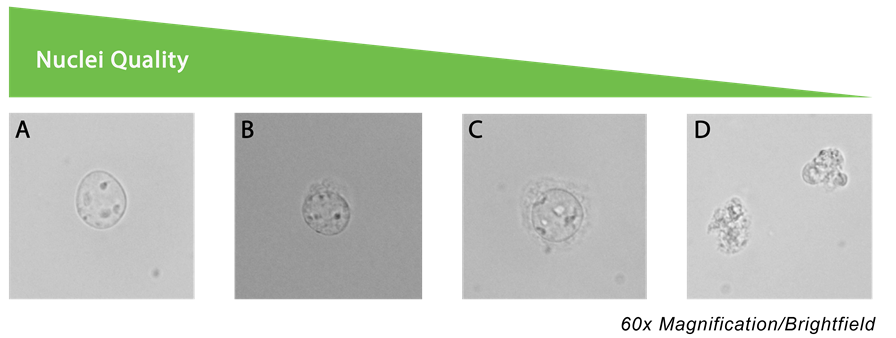

# Introduction

The mapping of the chromatin landscape provides insight into how cells are primed for gene regulation, including whether regulatory elements are in an active (“on”) or inactive (“off”) state under different biological conditions. Understanding chromatin accessibility therefore offers a deeper understanding of cellular differentiation states and regulatory potential that may not be captured by gene expression data alone.

Traditional methods used to study chromatin accessibility, such as FAIRE-seq and DNase-seq, typically require large numbers of cells and often suffer from low signal-to-background ratios. As a result, these approaches can require greater sequencing depth and larger sample sizes to achieve sufficient statistical power.

Recent technological advances have enabled the profiling of chromatin accessibility from very small numbers of cells with improved signal-to-noise ratios, while also reducing both time and cost requirements. This led to the development of ATAC-seq, which uses a hyperactive Tn5 transposase enzyme to simultaneously cleave accessible regions of chromatin and insert sequencing adapters in situ through a process known as tagmentation (see figure below). ATAC-seq can be applied to a wide range of cell populations, including freshly isolated ex vivo samples and in vitro cultured cells. Further optimisation of the protocol led to the development of Omni-ATAC-seq, which improves data quality and enables robust chromatin accessibility profiling from even fewer input cells.

```{r}
#| echo: false
knitr::include_graphics("images/fig_active_motif_atacseq.png")
```
Image Source: [Complete Guide to Understanding and Using ATAC-Seq](https://www.activemotif.com/blog-atac-seq)

## Experimental considerations

Although Omni-ATAC-seq offers substantial improvements in data quality compared with traditional chromatin accessibility assays, careful experimental design remains critical. Before beginning any experiment, it is important to clearly define the biological question being addressed. Examples of questions that ATAC-seq can help answer include: 

* How do chromatin accessibility landscapes differ between cell types? 
* Which transcription factors are likely driving a particular gene program? 
* Are accessibility changes maintained in memory or trained cells following an initial stimulus?

Basic experimental design considerations for ATAC-seq include the following:

* Ideal cell number inputs range between 5x10^3-5x10^4 cells. 1x10^4 cells is a good starting point.  
* Include at least two biological replicates per condition.  
* Increasing the number of biological replicates improves the robustness and statistical power of downstream analyses.  
* Standardise input cell numbers across conditions wherever possible to ensure consistency during tagmentation and library preparation.  
* For experiments performed across multiple timepoints, include a common biological control sample to help account for technical and batch variation over time.  
* To minimise batch effects, use consistent reagents and buffers across experiments, and where possible, perform library preparation for all samples simultaneously following tagmentation.  
* ATAC-seq is a bulk population-based assay and is therefore sensitive to cellular heterogeneity. Enrichment of the target population is highly recommended, typically through flow cytometric sorting, to ensure a homogeneous and viable cell population is analysed.  

ATAC-seq is a bulk population-based assay and is therefore sensitive to cellular heterogeneity within the sample being analysed. To minimise background noise and improve biological interpretability, enrichment of the target cell population is strongly recommended prior to library preparation. In most cases, this is achieved through flow cytometric cell sorting to isolate a homogeneous and viable population of cells for downstream analysis.

While chromatin accessibility profiling provides valuable regulatory information, ATAC-seq data are most informative when integrated with gene expression data generated from the same cell populations, such as RNA-seq or RT-qPCR data. Integrating these datasets enables the identification of positive control loci with known patterns of gene upregulation or downregulation, helping to validate whether accessibility changes correspond to expected transcriptional activity. Without complementary expression data, it can be challenging to confidently interpret the biological significance of chromatin accessibility changes alone.

Another important consideration is the type of downstream analysis planned for the dataset. Many biological questions can be addressed through standard differential accessibility analysis between cell types or experimental conditions. However, more advanced analyses, such as transcription factor footprinting or nucleosome positioning analysis, require substantially greater sequencing depth and higher-quality data. These analytical goals should therefore be considered during experimental design to ensure sufficient sequencing coverage is achieved.

Finally, optimisation of nuclei extraction is a critical step when establishing an Omni-ATAC-seq workflow for a new cell type. Different cell populations often require different lysis conditions to efficiently isolate intact nuclei. Insufficient nuclei extraction can lead to elevated mitochondrial DNA contamination and reduced sequencing efficiency, whereas excessive lysis may cause nuclear clumping, reduced signal-to-background ratios, and potential tagmentation failure. Considerable optimisation may therefore be required to identify conditions that consistently yield intact nuclei suitable for ATAC-seq library preparation. Existing nuclei isolation protocols can often serve as a useful starting point for optimisation.

For more guidelines it is recommended that users read the [ENCODE guidelines](https://www.encodeproject.org/atac-seq/) for ATAC-seq, a great resource for many NGS techniques.

```{r}
#| echo: false
knitr::include_graphics("images/fig_chromatin_profiling.png")
```
Image source: [Chromatin accessibility profiling by ATAC-seq](https://www.nature.com/articles/s41596-022-00692-9)

## Library generation

A major advantage of ATAC-seq over traditional chromatin accessibility assays is the simplicity and speed of library preparation. Following tagmentation, sequencing-ready libraries can be generated with only a single PCR amplification step, reducing both hands-on time and overall workflow complexity. In addition, ATAC-seq libraries are compatible with next-generation sequencing (NGS) platforms, enabling multiplexing of many samples within a single sequencing run and improving overall cost efficiency.

Briefly, individual ATAC-seq libraries are indexed using combinations of i5 and i7 sequencing primers. Typically, libraries share a common i5 primer while each sample is assigned a unique i7 index, allowing sequencing reads to be demultiplexed following sequencing. The number of unique index combinations required depends on the total number of samples included in the experiment. Additional unique i5 primers may also be incorporated to further expand multiplexing capacity. Importantly, index combinations should be discussed with the sequencing facility prior to library preparation to ensure compatibility with the sequencing platform being used.

Careful optimisation of PCR amplification cycles during library preparation is critical, as overamplification can increase PCR duplicate rates and reduce overall library complexity. To determine the optimal number of amplification cycles, libraries are commonly partially amplified before being assessed by quantitative PCR (qPCR) using standard Illumina sequencing primers that bind adapter sequences introduced during tagmentation. This step also serves as an important quality control metric, as only successfully tagmented DNA fragments will generate an amplification signal.

One commonly used approach for determining the final number of PCR cycles is outlined in the [Kaestner Lab Omni-ATAC Protocol](https://www.med.upenn.edu/kaestnerlab/assets/user-content/documents/ATAC-seq-Protocol-(Omni)-Kaestner-Lab.pdf). Briefly, fluorescence intensity is plotted against cycle number, and the optimal amplification point is selected at approximately one-third of the maximum fluorescence intensity (see figure below for an example). This approach helps minimise overamplification while ensuring sufficient material is generated for sequencing.

```{r}
#| echo: false
knitr::include_graphics("images/fig_fragment_size.jpg")
```
Image source: [ATAC-seq: A Method for Assaying Chromatin Accessibility Genome-Wide](https://pmc.ncbi.nlm.nih.gov/articles/PMC4374986/)

Each ATAC-seq library should be quantified and assessed for fragment size distribution using an instrument such as a bioanalyzer or fragment analyser. Accurate library quantification is important to ensure that sufficient material is available for sequencing, with most sequencing facilities typically requiring between 1–20 ng of DNA per sample. Final library yield can vary substantially depending on factors such as input cell number, cell type, tagmentation efficiency, and the number of PCR amplification cycles performed. However, a recommendation is that ATAC-seq libraries fall within a concentration range of approximately 10–40 ng/µL.

Fragment size analysis is also an important quality control step prior to sequencing. ATAC-seq libraries often contain unwanted small fragments, such as primer dimers, as well as excessively large fragments that may negatively impact sequencing performance. These unwanted fragments can be removed using double-sided AMPure bead size selection prior to sequencing, although exact requirements should be confirmed with the sequencing facility.

Ideally, ATAC-seq libraries should display a characteristic fragment distribution enriched for fragments between approximately 200–500 bp, corresponding to nucleosome-free and mononucleosome-associated regions of accessible chromatin (see figure below). In high-quality libraries, periodic banding patterns representing mono-, di-, and trinucleosome fragments may also be observed, reflecting underlying chromatin structure.

```{r}
#| echo: false
knitr::include_graphics("images/fig_atac_fragment_profile.png")
```
Image source: [Library QC for ATAC-Seq and CUT&Tag](ttps://www.activemotif.com/blog-library-qc)

## Sequencing considerations

For most ATAC-seq experiments, paired-end sequencing with read lengths of 50–75 bp is recommended. Paired-end sequencing enables accurate estimation of fragment sizes and improves the identification of nucleosome positioning patterns, with accessible chromatin fragments typically ranging from nucleosome-free regions to fragments approaching 1 kb in length.

Sequencing depth requirements will depend on the downstream analyses planned for the experiment. For standard peak calling and differential accessibility analyses, approximately 50 million mapped reads per sample is generally recommended. More advanced analyses, such as transcription factor footprinting, typically require substantially deeper sequencing coverage, often exceeding 200 million mapped reads per sample. ATAC-seq libraries are commonly sequenced on Illumina platforms such as the NovaSeq, NextSeq, or MiSeq depending on sample throughput and project requirements.

## Limitations of ATAC-seq

* Although ATAC-seq is a powerful technique for studying chromatin accessibility across different cell populations and conditions, several important limitations should be considered when interpreting results.
* ATAC-seq measures chromatin accessibility but does not directly identify the molecular mechanisms driving these accessibility changes. For example, it does not provide information on epigenetic modifications such as DNA methylation or histone modifications. As a result, ATAC-seq alone cannot confidently distinguish between regulatory elements such as active, poised, or repressed enhancers without complementary datasets.
* ATAC-seq does not provide information about three-dimensional chromatin organisation, including chromatin looping, topologically associated domains, or long-range regulatory interactions across the genome.
* Although chromatin accessibility often correlates with gene expression, accessibility changes do not always result in transcriptional changes. Without paired gene expression datasets, such as RNA-seq, it can be difficult to confidently determine the functional consequences of accessibility changes.
* Motif enrichment and de novo transcription factor binding analyses can identify candidate transcription factors that may regulate observed accessibility patterns. However, these predictions remain indirect and typically require experimental validation using techniques such as ChIP-seq, CUT&Tag, or CUT&Run.
* The hyperactive Tn5 transposase enzyme used during tagmentation exhibits sequence- and context-dependent biases. Tn5 preferentially inserts into highly accessible DNA and regions resembling transcription factor binding motifs, which can distort accessibility measurements and complicate interpretation of transcription factor footprinting analyses.
* Bulk ATAC-seq represents an average signal across an entire cell population and therefore cannot resolve cellular heterogeneity. Apparent intermediate accessibility signals at a genomic locus may reflect mixtures of fully accessible and inaccessible cells rather than true intermediate chromatin states.
* Poor sample viability can negatively impact library quality. Dead or damaged cells may contribute excess mitochondrial DNA contamination, while low-quality nuclei preparations can lead to nuclear clumping, reduced signal-to-background ratios, and tagmentation failure.

```{r}
#| echo: false

```
Image source: [Best practices for working with nuclei](https://kb.10xgenomics.com/s/article/360050780051-What-are-the-best-practices-for-working-with-nuclei-samples-for-3-single-cell-gene-expression)

## ATAC-seq Output and Data Visualisation

Common downstream analyses and visualisation approaches used in ATAC-seq studies include:

* Fragment size distribution plots
* Fragments of reads in peaks (FRiP) score: Visualisation of data quality. Typical guidelines indicate that a FRiP score above 0.3 indicating 30% of reads in peaks is sufficient for high-quality ATAC-seq data.
* Principal component analysis (PCA) plots
* Spearman and Pearson correlation heatmaps:  visualisation of sample similarities similar and often better than PCA. Can be used to make broad statements on sample reproducibility with replicates ideally sitting closest together and similarities between cell populations also shown.
* Differential accessibility volcano plots: Basic visualisation of differential region accessibility (DAR) between two cell populations. Can be used to quickly illustrate the number and bias of gene regions that either open or close.
* Genomic accessibility tracks displayed in genome browsers
* Annotation of accessible regions to genomic features: Provides information about the genomic distribution of differential accessible regions. Often useful when determining if differential genomic regions are biassed towards certain genomic elements such as TSS or intergenic regions which may suggest changes in enhancer regions.
* Heatmaps of differentially accessible regions: Visualisation of DARs across multiple different cell populations. Often useful when determining whether DARs are shared or unique across more than one population of interest. Can be used to visualise DAR patterns.
* Integration and correlation analyses between ATAC-seq and RNA-seq datasets: Basic function to determine how changes in accessible correlate with gene expression changes. Given that multiple regions can be mapped to the same gene, correlations are often filtered on DAR around TSS.
* De Novo transcription factor motif enrichment analysis: Tools such as HOMER can be used to determine the enrichment of certain known and unknown TF motifs that are enriched amongst regions of interest. Whilst useful for understanding potential TF involved in driving gene expression or chromatin remodelling, these are de novo predictions and should be further validated downstream. Also tools often limited by the available TF binding datasets like ChIP-seq, CUT&TAG and CUT&RUN or known TF binding motifs within the tools reference dataset.
* Nucleosome occupancy and positioning analysis
