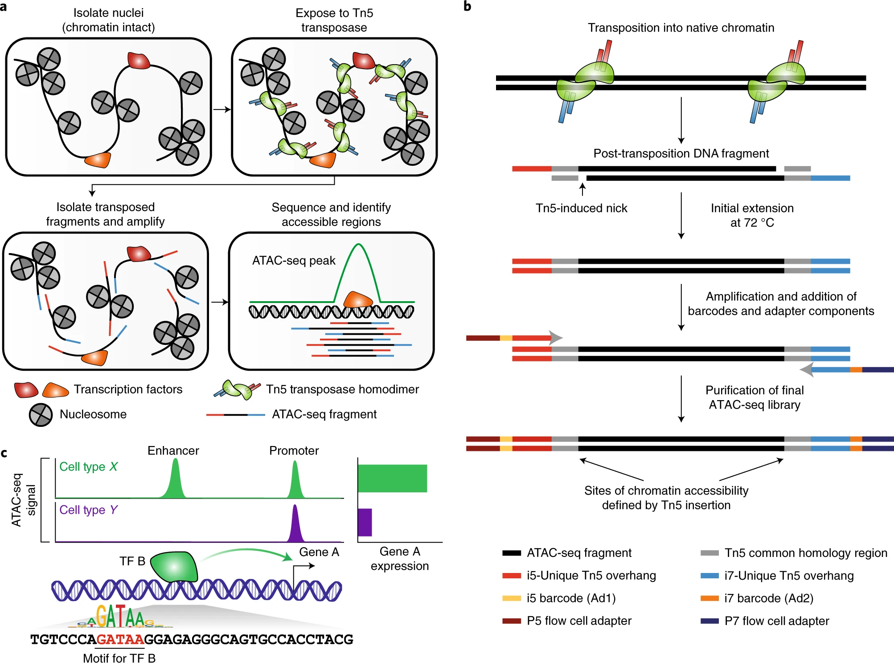

# Introduction

-   Overview of the technolgoy

-   Original protocol, omni-atac protocol

-   ATACseq experimental design:

-   sequencing depth requirements

-   lab based QC to check if good quality samples? Fragment analyser, NA content

-   what is the goal

-   Goal of the analysis: identify differential accessible regions or TF/nucleosome footprinting?

[{#fig-atacseq_protocol_2 fig-align="center"}](https://www.nature.com/articles/s41596-022-00692-9)