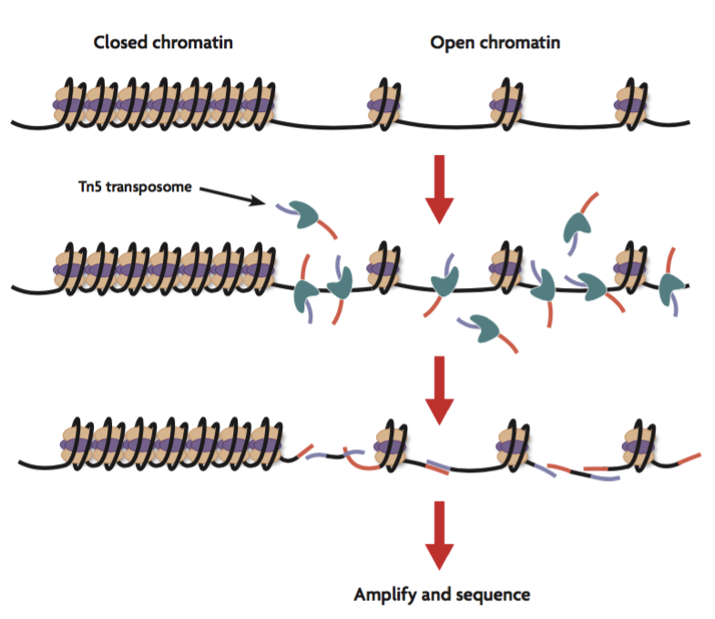
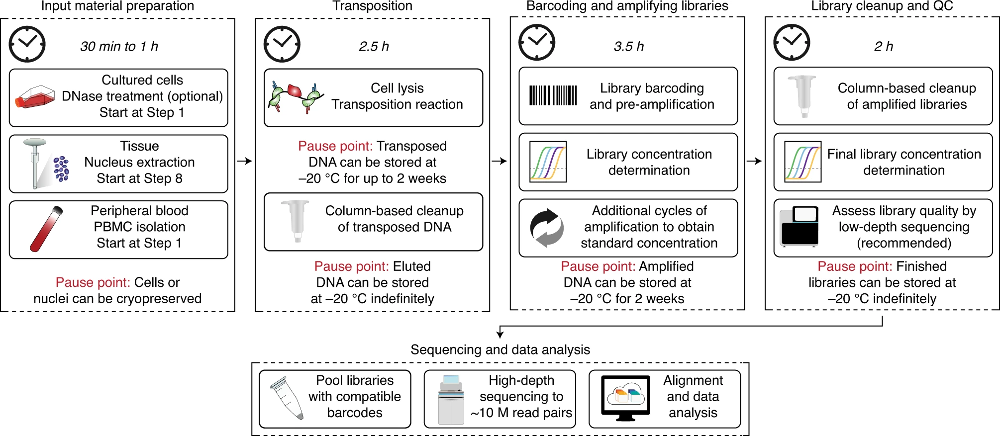
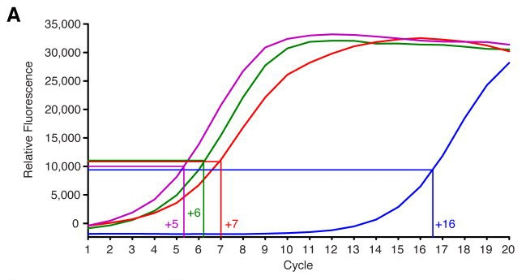
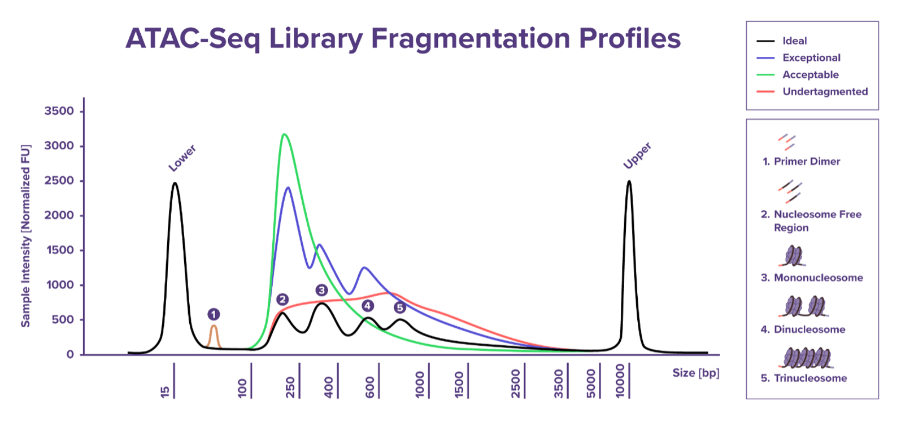

# Introduction


The mapping of the chromatin landscape can help understand how cells are poised for gene regulation including when a gene element is turned ‘off’ or ‘on’ based on a number of biological conditions. Understanding chromatin accessibility, therefore provides a deeper understanding of a cell's differentiation state often not observed by gene expression data alone.

Whilst traditional techniques used to study chromatin accessibility include FAIR-seq and DNASE-seq, these techniques require large amounts of cell numbers and often have very low signal-to-background requiring many more samples in order to generate statistically significant results. 

Recent advances in technology allow for the mapping of chromatin changes in very small cell numbers, high signal-to-noise and low time and cost investment. This has led to the development of the assay for transposase-accessible chromatin by sequencing or ATAC-seq which leverages an overactive form of transposes 5 (Tn5) which binds to exposed chromatin elements and cleaves in situ depositing custom DNA probes for ease of PCR amplification (tagmentation) (Figure 1). ATAC-seq can be used to study chromatin accessibility in a variety of cell populations including directly ex vivo or in vitro cultures. ATAC-seq has been further optimised and replaced with omniATAC-seq which offers better results with fewer cells needed. 

```{r}
#| echo: false

```

[Image Source:](https://www.activemotif.com/blog-atac-seq)

### Experiment considerations

Whilst omniATAC-seq offers superior data generation than traditional techniques, it is important to consider the biological questions being asked prior to the commencement of any experiments. Examples of biological questions ATAC-seq can help answer including How do chromatin accessibility landscapes differ between cell types? Which transcription factors are likely driving this gene program? Are there stable accessibility changes in memory or trained cells compared with naïve cells after an initial stimulus?

Basic experimental design recommendations for ATAC-seq include the following:

1. At least 2 biological replicates per condition
* The more biological replicates the more robust your statistical tests downstream will be

2. Standardise cell numbers per condition where possible
* Ensures parody across samples during tagmentation and library generation.

3. ATAC-seq experiments performed across different timepoints should have a common biological sample for controlling for technique and time batch effects.
* To avoid unnecessary batch effects the same buffers should be used across experiments and library generation following tagmention should be completed together across all samples sequenced.

ATAC-seq is a bulk analysis of a population of interest requiring the user to enrich their populations of interest to avoid noise that may be caused from heterogeneity within the tested populations. It is recommended that samples be sorted via flow cytometry to ensure a homogeneous and live population of cells are used throughout the technique.

Mapping chromatin accessibility can provide useful information; it is recommended that this data be paired with gene expression data from the same populations, this can be RNA-seq or even RT-PCR data, to better understand how chromatin accessibility changes can influence gene expression patterns. Why is this useful? It provides positive control gene loci that you know are upregulated or downregulated in your cell populations of interest to understand better if your ATAC-seq experiment was successful. Without this, it can be hard to form biological conclusions on chromatin accessibility alone. 

Another important consideration when designing your experiment is the types of analysis you wish to complete downstream of your ATAC-seq. Whilst most biological questions can be answered with simple differential analysis of accessible regions between two cell types or states, some biological questions demand more robust forms of analysis such as footprinting of transcription factor binding or nucleosome mapping. These complex analyses require significantly more sequencing depth than differential analysis alone, and thus will influence your experimental design to ensure sufficient sequencing depth is achieved to answer these questions. 

Lastly, in attempting omniATAC-seq on your cell population of interest, there must be significant optimisation in nuclei extraction protocols as different cell-types require different cell lysis conditions. If cell nuclei are underextracted it will result in increased mitochondrial DNA contamination and inefficient sequencing data and costs. Overextraction of nuclei can result in nuclei clumping leading to decreased signal-to-background and even tagmentation failure. Time must be invested to ensure intact nuclei can be extracted from your cell population of interest existing nuclei extraction protocols can be used for ATAC-seq.

```{r}
#| echo: false

```

Image source: [Chromatin accessibility profiling by ATAC-seq](https://www.nature.com/articles/s41596-022-00692-9)

### Library generation

A significant advantage of ATAC-seq over traditional techniques is that tagmented DNA can be quickly and easily used to generate your libraries of interest requiring only a single PCR amplification step following tagmentation. ATAC-seq samples are sequenced on next-gen sequencing machines allowing for multiplexing of multiple samples into the single sequencing run offering superior cost efficiency than other techniques. Briefly, individual ATAC-seq samples are barcoded with a common i5 primer and unique i7 primers that allow for the demultiplexing of sample sequences. The number of unique i7 primers included in your experiment will depend on the number of samples within your experiment. Unique i5 primers can also be included to expand the number of samples that can be sequenced together. This should be discussed with your sequence facility prior to library generation to ensure that the combinations of i5 and i7 primers used are compatible with your NGS machine.

The number of optimal PCR cycles when generating ATAC-seq libraries is critical to minimise overamplification of ATAC-seq libraries resulting in fewer PCR duplicates removed during data curation. The number of optimal PCR cycles per library can be determined by RT-qPCR, whereby libraries are partially amplified before running on a qPCR machine with common Illumina sequencing primers which bind a common sequence that is present in tagmented DNA. This step also offers a great QC metric of your ATAC-seq libraries as only tagmented DNA will produce a signal in your library allow for you to detect if your ATAC-seq samples have worked. Briefly and outlined in (https://www.med.upenn.edu/kaestnerlab/assets/user-content/documents/ATAC-seq-Protocol-(Omni)-Kaestner-Lab.pdf) The number of additional PCR cycles per library can be determined by taking, plot fluorescence versus cycle and determine the cycle number that corresponds to one-third of the maximum fluorescent intensity (See figure below for an example).

```{r}
#| echo: false

```

Image source: [ATAC-seq: A Method for Assaying Chromatin Accessibility Genome-Wide](https://pmc.ncbi.nlm.nih.gov/articles/PMC4374986/)


Each ATAC-seq library should be quantified and fragments should be analysed using a fragment analyser. Quantification of each library is necessary to ensure sufficient material is present for sequencing (1-20ng of DNA per sample). The exact of DNA present in each library will depend on the number of cells used, the cell type of interest, the efficiency of tagmention and the number of cycles used to amplify the libraries, however, a recommendation is usually between 10-40 ng/ul.

Often ATAC-seq libraries ran on a bioanalyzer will reveal many smaller and larger fragments that will need to be removed prior to sequencing using double-sided ampure bead size exclusion, this should be discussed with your sequencing facility prior to submission for sequencing. The ideal fragment sizes needed for ATAC-seq include fragments between 200-500bp representing nucleosome free and mononucleosome regions of interest (see below a figure from (https://www.activemotif.com/blog-library-qc).  

```{r}
#| echo: false

```

Image source: [Library QC for ATAC-Seq and CUT&Tag](ttps://www.activemotif.com/blog-library-qc)

### Sequencing considerations

ATAC-seq sequencing prioritizes paired-end reads with 50-75 bp lengths to capture nucleosome positioning and fragment sizes up to 1 kb. Target 50 million mapped reads per sample for peak calling (200 million+ for footprinting), using Illumina platforms like NovaSeq, NextSeq, or MiSeq.

Limitations of ATAC-seq

Whilst ATAC-seq is a great technique for understanding how chromatin accessibility changes between cell populations, there are some limitations of the technique that must be considered. 

1. ATAC-seq only discerns changes in chromatin accessibility but provides no information of the drivers of these changes such as epigenetic marks like DNA methylation of histone modifications. Without histone modification data ATAC-seq can not be used to define regulatory elements such as active or poised enhancers confidently.

2. ATAC-seq provides no 3D chromatin architecture information such as looping, compartments or potential long-range interactions which exist across the genome. 

3. Whilst chromatin accessibility does strongly correlate with gene expression, without paired gene expression data it is impossible to confidently conclude if chromatin changes do lead to changes in gene expression

4. De novo Transcription factor binding analysis can provide useful information about potential TFs that may be driving gene expression profiles but these will need to be experimentally validated using ChIP-Seq, CUT&Tag or CUT&Run.

5. Tn5 transposase has sequence‑ and context‑dependent bias, favoring exposed DNA and TF‑binding‑site‑like regions, so it can under‑represent some occupied regulatory elements and distort footprint‑like signals.

6. Bulk ATAC‑seq cannot resolve heterogeneity within a mixed population; apparent “intermediate” accessibility at a locus may reflect a mixture of fully open and fully closed cells rather than graded regulation.

7. Low viability of cell populations can lead to nuclei clumping and tagmentation failure.

ATAC-seq output and data visualisation
Basic graphs with functions.
FRiP score
PCA plot
Pearson correlation heatmap
Differentional analysis volcano plots
Mapping of genomic elements
Heatmap of differential accessible regions
Correlation between ATAC-seq and RNA-seq


